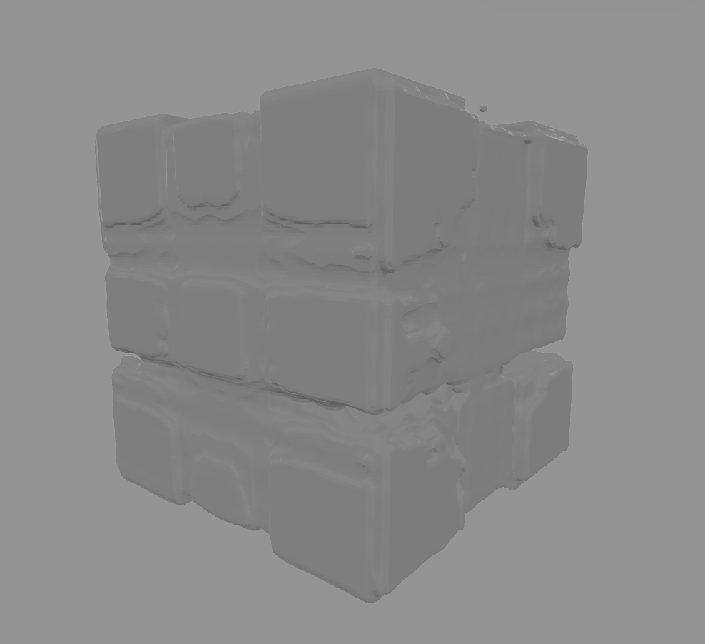
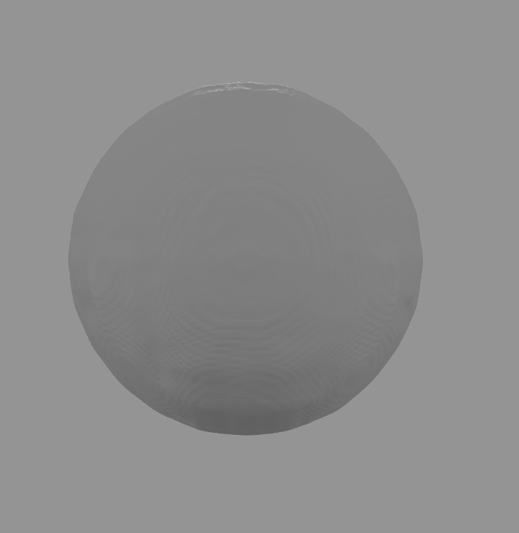

# Prometheus - 3D Model Generator

A beautiful native macOS application (optimized for Apple Silicon M-Series chips) that uses OpenAI Shap-E to generate 3D models from text prompts or images, with optional PBR material generation.

## What It Does

Prometheus is a native macOS app optimized for Apple Silicon (M1, M2, M3, M4) that brings the power of OpenAI's Shap-E 3D generation to your desktop. With a beautiful SwiftUI interface, you can:

- **Generate 3D models from text descriptions** - Simply describe what you want and get a 3D model
- **Convert images to 3D models** - Upload an image and transform it into a 3D object
- **Generate PBR materials** - Optional material generation creates albedo, roughness, metallic, and bump maps for your models
- **Export in standard formats** - Models are saved as PLY files and USDZ files (for iPhone/Vision Pro compatibility)
- **Native Apple Silicon performance** - Optimized for M-Series chips with MPS (Metal Performance Shaders) acceleration

The app uses a Python backend powered by OpenAI Shap-E, providing state-of-the-art text-to-3D and image-to-3D generation capabilities. Material generation is powered by MaterialAnything for high-quality PBR textures.

## Examples

Here are some example 3D models generated with Prometheus:

<div align="center">
  
  
  
</div>

## Features

- 🎨 Beautiful, modern SwiftUI interface
- 📝 Text-to-3D generation (Shap-E)
- 🖼️ Image-to-3D generation (Shap-E)
- 🎬 **NeRF (Neural Radiance Fields)** - Reconstruct 3D scenes from multiple images (experimental)
- 🎨 **PBR Material Generation** - Generate albedo, roughness, metallic, and bump maps (optional)
- 🚀 **Native Apple Silicon Support** - Optimized for M1/M2/M3/M4 chips with MPS acceleration
- 📱 USDZ export for iPhone and Vision Pro compatibility
- 🐍 Python backend integration
- ⚡ Real-time generation status
- 📁 Easy output file management

## Prerequisites

- **macOS 13.0 or later**
- **Apple Silicon (M1/M2/M3/M4)** - Optimized for native performance with MPS acceleration
  - Intel Macs supported but may be slower (CPU mode)
- Xcode 15.0 or later
- Python 3.9, 3.10, or 3.11 (recommended - Shap-E compatibility)
  - Note: Python 3.12+ may have compatibility issues
- Git (for installing Shap-E from GitHub)
- OpenAI API key (optional - for Shap-E model downloads)

## Setup Instructions

### 1. Create Python Virtual Environment

**Recommended: Use Python 3.9, 3.10, or 3.11**

**Clone the repository:**
```bash
git clone https://github.com/caraveo/Prometheus.git
cd Prometheus
```

**Create virtual environment:**

If you have multiple Python versions installed:
```bash
python3.11 -m venv env  # or python3.10, python3.9
source env/bin/activate
```

Or use the default Python 3:
```bash
python3 -m venv env
source env/bin/activate
```

### 2. Install Python Dependencies

**Option A: Use the automated setup script (recommended)**
```bash
./setup.sh
```

**Option B: Manual installation**
```bash
pip install --upgrade pip
pip install -r requirements.txt
pip install git+https://github.com/openai/shap-e.git
```

**Note:** Shap-E must be installed from GitHub as it's not available on PyPI.

### 2.5. Download MaterialAnything Models (Optional)

To enable PBR material generation, download the MaterialAnything models:

```bash
./download_material_models.sh
```

This will download the material estimator and refiner models from HuggingFace (~2-3GB). Material generation works without these models but will use simplified mode.

### 3. Set OpenAI API Key (Optional but Recommended)

Shap-E models will be downloaded automatically on first use. If you want to use OpenAI API:

```bash
export OPENAI_API_KEY="your-api-key-here"
```

### 4. Build and Run the Swift App

#### Option A: Using Xcode

1. Open Terminal and navigate to the project directory
2. Create an Xcode project:
   ```bash
   swift package generate-xcodeproj
   ```
3. Open `Prometheus.xcodeproj` in Xcode
4. Build and run (⌘R)

#### Option B: Using Swift Package Manager (Recommended)

**Best method - launches as proper macOS app with focus:**
```bash
./run.sh
```

This will:
- Build the app
- Create a proper macOS app bundle
- Launch it with proper window focus

**Alternative - direct run (may have focus issues):**
```bash
swift build
swift run Prometheus
```

#### Option C: Create Xcode Project Manually

1. Open Xcode
2. File → New → Project
3. Choose "macOS" → "App"
4. Set Product Name to "Prometheus"
5. Choose SwiftUI for Interface
6. Add the Swift files to the project
7. Build and run

## Usage

1. **Text-to-3D Mode:**
   - Select "Text to 3D" mode
   - Enter a descriptive prompt (e.g., "a red sports car", "a wooden chair")
   - (Optional) Toggle "Generate Materials" to create PBR material maps
   - Click "Generate 3D Model"

2. **Image-to-3D Mode:**
   - Select "Image to 3D" mode
   - Drag and drop an image into the drop zone
   - Optionally add a text prompt for additional guidance
   - (Optional) Toggle "Generate Materials" to create PBR material maps
   - Click "Generate 3D Model"

3. **NeRF Mode (Experimental):**
   - Select "NeRF (Multi-Image)" mode
   - Select a directory containing multiple images of the same scene from different angles
   - NeRF will reconstruct a 3D scene from the images
   - **Note:** NeRF requires TensorFlow 1.15 and CUDA, which may not work on Apple Silicon. Consider using modern NeRF implementations for M-Series chips.

4. **View Results:**
   - Generated models are saved in the `output/` directory
   - Click the folder icon to reveal the file in Finder
   - Models are saved as `.ply` files (compatible with most 3D software)
   - USDZ files are automatically generated for iPhone/Vision Pro compatibility
   - Material maps (if generated) are saved in `output/materials/` directory

## Project Structure

```
Prometheus/
├── PrometheusApp.swift      # Main app entry point
├── ContentView.swift         # Main UI view
├── shap_e_generator.py      # Python backend script (Shap-E)
├── material_generator.py     # MaterialAnything material generation module
├── nerf_generator.py         # NeRF (Neural Radiance Fields) integration module
├── download_material_models.sh # Script to download MaterialAnything models
├── material_anything/        # MaterialAnything repository
├── nerf_repo/                # NeRF repository (bmild/nerf)
├── requirements.txt          # Python dependencies
├── Package.swift            # Swift package configuration
├── setup.sh                 # Automated setup script
├── run.sh                   # Build and launch script
├── build.sh                 # Build script
├── README.md                # This file
├── .gitignore               # Git ignore rules
└── env/                     # Python virtual environment (created during setup)
```

## Installation

### Quick Start

1. **Clone the repository:**
   ```bash
   git clone https://github.com/caraveo/Prometheus.git
   cd Prometheus
   ```

2. **Run the setup script:**
   ```bash
   chmod +x setup.sh
   ./setup.sh
   ```
   
   This will:
   - Create a Python virtual environment
   - Install all required dependencies
   - Install Shap-E from GitHub

3. **Launch the app:**
   ```bash
   chmod +x run.sh
   ./run.sh
   ```

That's it! The app will build and launch automatically.

## Troubleshooting

### Python Environment Not Found
- Ensure the virtual environment is created: `python3 -m venv env`
- Make sure you're in the project root directory

### Import Errors
- Activate the virtual environment: `source env/bin/activate`
- Reinstall dependencies: `pip install -r requirements.txt`

### Model Download Issues
- Shap-E models are large (~2GB). Ensure you have sufficient disk space
- First generation may take longer as models download
- Check your internet connection

### GPU Support
- **Apple Silicon (M1/M2/M3/M4)**: Automatically uses MPS (Metal Performance Shaders) for GPU acceleration
- **CUDA**: Automatically uses CUDA if available (NVIDIA GPUs)
- **CPU**: Falls back to CPU mode if no GPU is available (slower but functional)
- Material generation works on all platforms, with full MaterialAnything pipeline requiring CUDA

## Notes

- **Apple Silicon Performance**: Optimized for M-Series chips with native MPS acceleration for faster generation
- First generation may take 5-10 minutes as models download and initialize
- Subsequent generations are faster (typically 1-3 minutes on M-Series chips)
- Generated models are saved as PLY files, compatible with Blender, MeshLab, and other 3D software
- USDZ files are automatically generated for spatial computing (iPhone/Vision Pro)
- Material generation is optional and works in simplified mode without MaterialAnything models
- Full MaterialAnything material generation requires CUDA and additional dependencies (pytorch3d, kaolin)

## License

This project uses OpenAI Shap-E, which is subject to OpenAI's terms of use.

